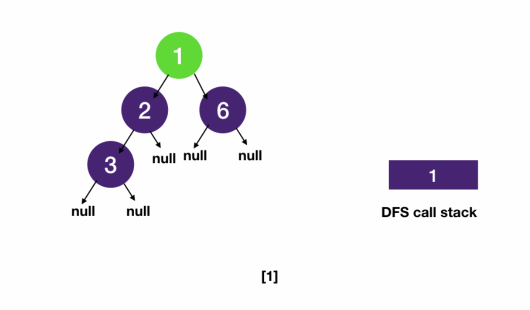
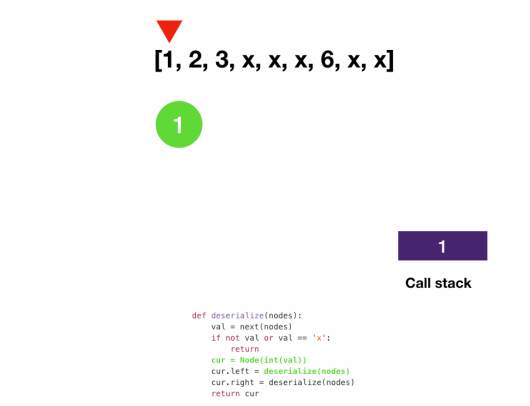

# Depth First Search: DFS on Tree
## Serializing and Deserializing Binary Tree
```
Given a binary tree,
write a serialize function that converts the tree into a string
and a deserialize function that converts a string to a binary tree.
You may serialize the tree into any string representation you want as long as it can be deseralized.
```
```javascript
class Node {
  constructor(val, left = null, right = null) {
    this.val = val;
    this.left = left;
    this.right = right;
  }
}

function serialize(root) {
  let res = [];
  serialize_dfs(root, res);
  return res.join(" ");
}

function serialize_dfs(root, res) {
  if (!root) {
    res.push("x");
    return;
  }
  res.push(root.val);
  serialize_dfs(root.left, res);
  serialize_dfs(root.right, res);
}

function deserialize(s) {
  // create an iterator that returns a token each time we call `next`
  return deserialize_dfs(s.split(" ")[Symbol.iterator]());
}
```
### Explanation
- To serialize, we can simply do a DFS and append the node value to the string
  - We need to encode null nodes too since otherwise we wouldn't be able to tell if we have reached leaf nodes when we deserialize
  - We use x here as a placeholder for the null node
- To deserialize, we split the string into tokens and consume them
  - For each token we create a new node using token value. When we see an x we know we reached the leaf and return
### Serialize



### Deserialize


