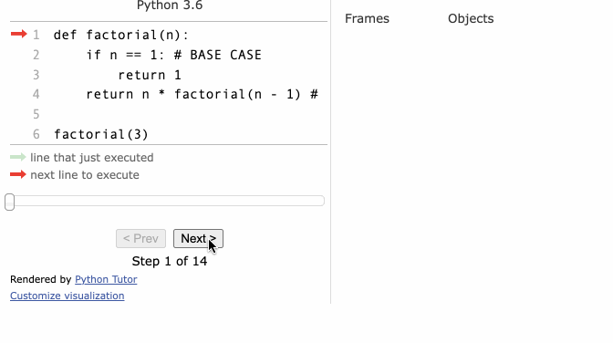

# Depth First Search pattern
## Recursion pattern
- one of the most important concepts in computer science
- it is the process of a function calling itself
### key components in writing a correct recursive function
1. Base case/exit
2. Recursive call, i.e. calling the function itself with different argument
### Example



#### Javascript
```javascript
const people = ["Andy", "Carly"];

function callForLunch(personIndex) {
  if (people[personIndex] === "Carly") {  // BASE CASE
    return true;
  }
  return callForLunch(personIndex + 1);  // RECURSIVE CALL
}

console.log(callForLunch(0));
```
- find factorial example
```javascript
function factorial(n) {
  if (n <= 1) {  // base case
    return 1;
  }
  return n * factorial(n - 1);  // recursive call
}

console.log(factorial(5));
```
- the computer calls the function itself by using a stack behind the scene to keep track of where things are
- computer's internal stack is called `call stack`
- the data it pushes onto a call stack are called `stack frame`
  - stack frames on a call stack represent the function you are calling and its arguments
```javascript
function factorialStack(n) {
  const stack = [];
  while (n > 0) {
    stack.push(n);
    n--;
  }

  result = 1;

  while (stack.length) {
    result *= stack.pop();
  }

  return result;
}

console.log(factorialStack(5));
```
