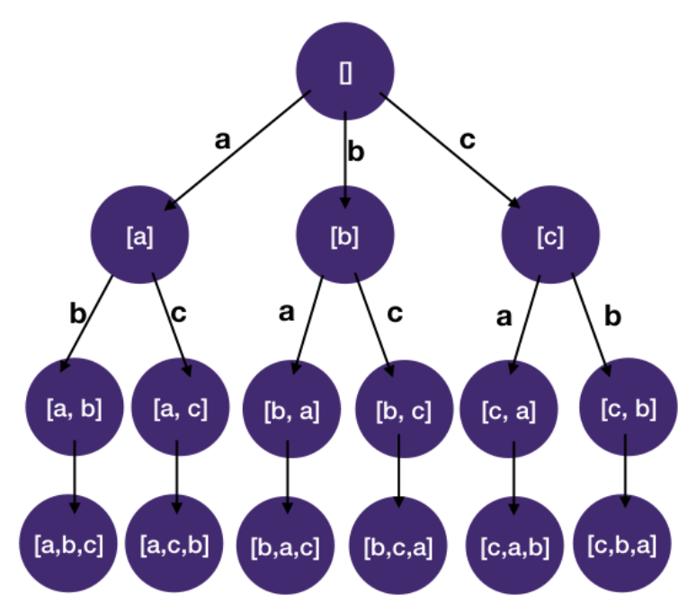

# Backtracking
## Combinatorial Search pattern
- Combinatorial search problems involve finding grouping and assignments of objects that satisfy certain conditions
- Finding all permutations/subsets, solving sudoku, and 8-queens are classic combinatorial problems
### Permutations
- permutation means arranging things with an order
  - i.e. permutation of `[a, b, c]` is `[a, b, c]`, `[a, c, b]`, `[b, a, c]`, `[b, c, a]`, `[c, a, b]`, `[c, b, a]`
- important to review basic high school combinatorics to get an intuition for combinatorial problems
- The number of permutations is given by `n!`
- i.e. a bag of 3 letters, total number of choices is `3 * 2 * 1 = 6`, have 6 leaf nodes in a tree



### Complexity
- The complexity of combinatorial problems often grows rapidly with the size of the problem
  - i.e. the number of permutation of 3 objects is only 6
    - However, number of permutation of 10 objects is about 3 million
    - The number of permutations of 11 objects is about 40 million
  - The rapid growth of solution space with even a small increase in problem size is called `combinatorial explosion`

### Combinatorial search == DFS on tree
- In combinatorial search problems, search space is in the shape of a tree
- The tree that represents all the possible states is called a `State-space Tree`
- Each node of the `state-space tree` represents a state we can reach in a combinatorial search (by doing a particular combination)
  - Leaf nodes are the solutions to the problem
- Combinatorial search problems boil down to DFS / backtracking on the `state-space tree`
- Since the search space can be quite large, we often have to `prune` the tree
  - i.e. discard branches
#### Three steps to conquer combinatorial search problems
1. Identify the state(s)
    - we want to answer the following 2 questions to identify the states
      1. What state do we need to know whether we have reached a solution (and using it to construct a solution if the problem asks for it)
          - i.e. we keep track of the letters we have already selected when we do DFS for `[a, b, c]` example
      2. What state do we need to decide which child nodes should be visited next and which ones should be pruned
          - i.e. we have to know what are the letters left that we can still use (since each letter can only be used once) for `[a, b, c]` example
2. Draw the state-space tree
    - you want to draw the tree (on a piece of paper if you have one)
    - A small test case that's big enough to reach one solution (leaf node)
    - after drawing the tree, simply traverse the tree depth-first
3. DFS / backtrack on the state-space tree
    - apply the following `backtracking template`
    ```javascript
    function dfs(node, state):
      if state is a solution:
        report(state) # e.g. add state to final result list
        return

      for child in children:
        if child is a part of a potential solution:
          state.add(child) # make move
          dfs(child, state)
          state.remove(child) # backtrack
    ```
- unlike the following `Ternary Tree Paths` example which has an explicit tree, in combinatorial search problems we have to find our own tree
### DFS with states
#### Ternary Tree Paths
- each node of the tree has at most three children, find all root-to-leaf paths
- use path to keep track of the nodes we have visited to reach the current node and use it to construct our solution when we reach leaf nodes
#### Javascript
```javascript
class Node {
  constructor(val, children = []) {
    this.val = val;
    this.children = children;
  }
}

function dfs(root, path, res) {
  // exit condition, reached leaf node, append paths to results
  if (root.children.length === 0) {
    path.push(root.val);
    const cur_path = path.join('->');
    res.push(cur_path);
    path.pop();
    return;
  }
  // dfs on each non-null child
  for (const child of root.children) {
    if (child) {
      path.push(root.val);
      dfs(child, path, res);
      path.pop();
    }
  }
}

function ternaryTreePaths(root) {
  let res = [];
  if (root) dfs(root, [], res);
  return res;
}

const one = new Node(1);
const two = new Node(2);
const four = new Node(4);
const six = new Node(6);
const three = new Node(3);

one.children = [two, four, six];

two.children = [three];

const result = ternaryTreePaths(one);
console.log(result);
```
