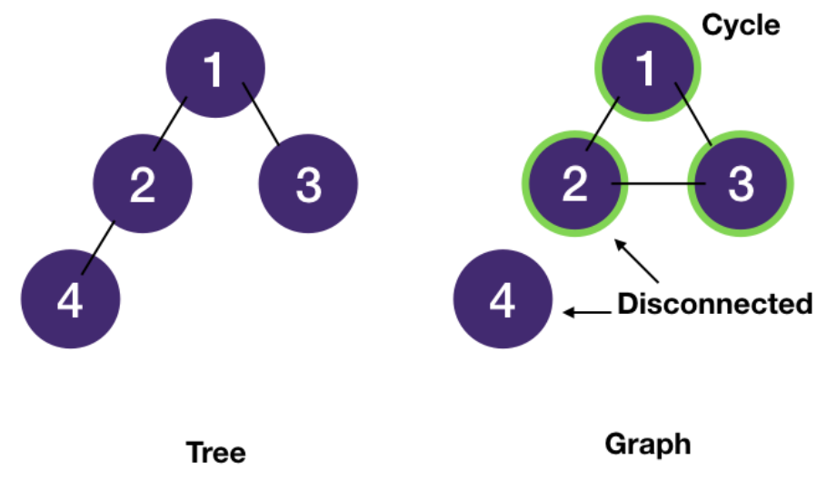
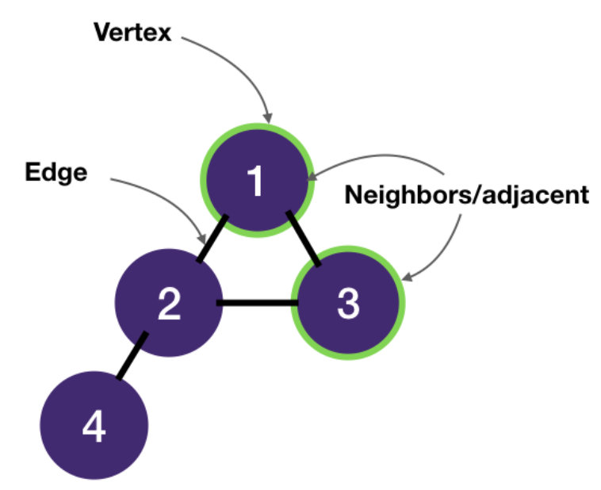
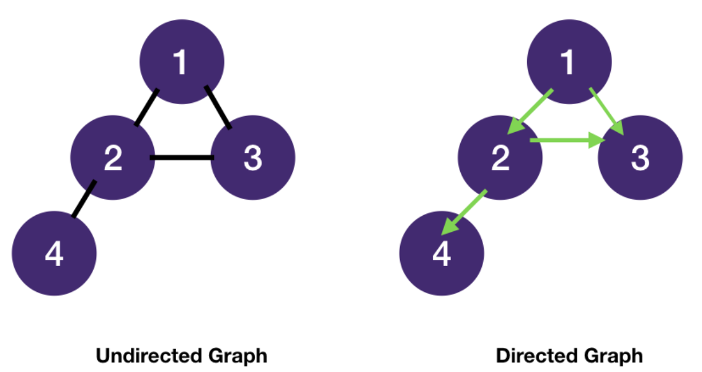
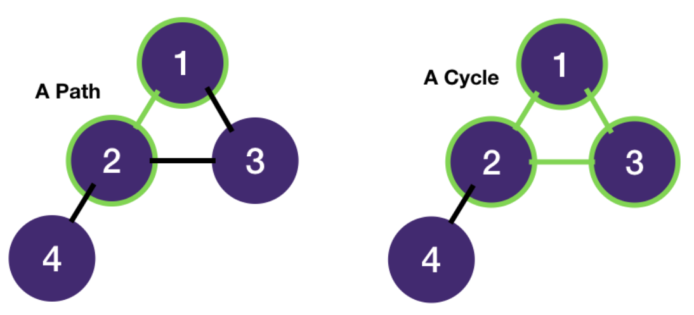
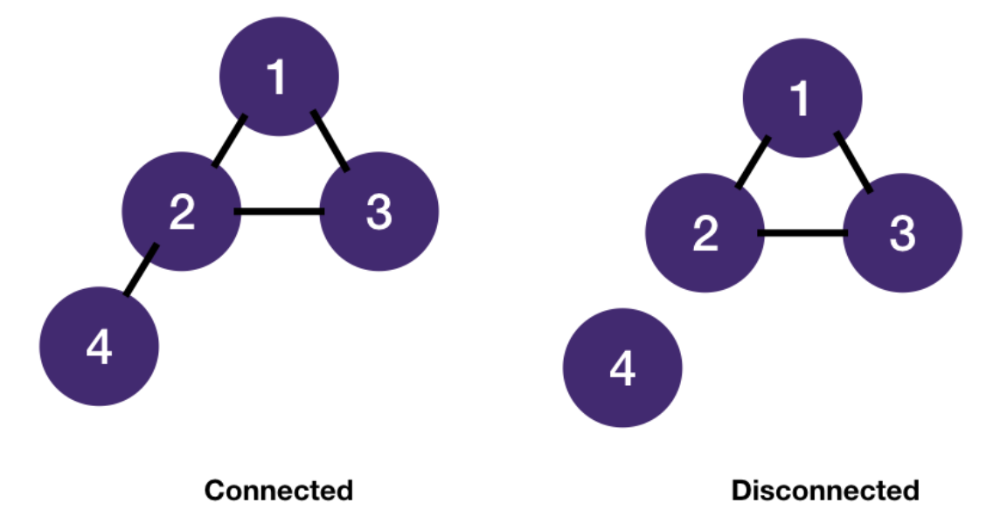
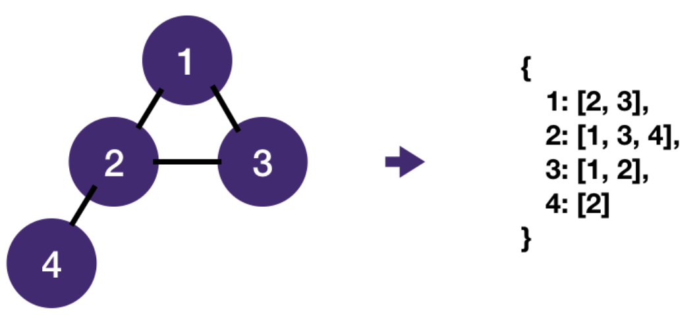

# Graph pattern
## Fundamentals
### Tree with 0+ cycle
- A tree is a special graph - a connected acyclic (cycle-less) graph.
- A graph may contain cycle(s) and nodes could be disconnected.
- A tree also contains n nodes and n - 1 edges in addition to being acyclic and there exists only 1 path between 2 nodes in a tree.

### Graph Terminologies
- A graph consists of vertices ("nodes" in trees) and edges.
- Vertices are connected by edges.
- Two vertices connected by an edge are called neighbors and are adjacent ("children" in trees).

- Edges can be undirected or directed. For most interview problems we are dealing with undirected graphs.
- A tree is also an undirected graph.

- A path is a sequence of vertices.
- A cycle is a path that starts and ends at the same vertex.

- An undirected graph is connected if every vertex is joined by a path to another vertex.
- Otherwise, it's disconnected.

- A graph is most commonly stored as a map of adjacency lists: for each vertex, store a list of its neighbors.

- Note that even though a graph is represented as an adjacency list , we don't actually have to create it upfront.
- What we really need is a function to get a vertex's neighbors. 
