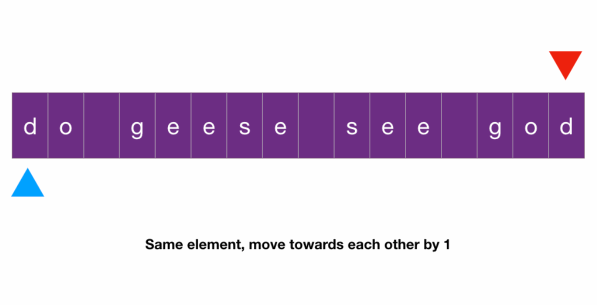

# Two Pointers: Opposite Direction
## Valid Palindrome
```
Determine whether a string is a palindrome, ignoring non-alphanumeric characters and ignore case.

Examples:
  Input: Do geese see God?
  
  Output: True

  Input: Was it a car or a cat I saw?
  
  Output: True

  Input: A brown fox jumping over
  
  Output: False
```
```javascript
function isAlphabet(c) {
  return /^[a-zA-Z]*$/.test(c);
}

function isPalindrome(s) {
  let left = 0;
  let right = s.length - 1;
  while (left < right) {
    if (!isAlphabet(s[left])) left++;
    if (!isAlphabet(s[right])) right--;
    if (s[left].toLowerCase() !== s[right].toLowerCase()) {
      return false;
    }
    left++;
    right--;
  }
  return true;
}
```
### Explanation



- This is a straightforward two-pointer problem
- We have two pointers l and r starting from the leftmost and rightmost position and moving towards each other
- At each step, if the elements they point to are the same we move each pointer one position towards each other
- If the elements under the pointers are different at any step, then the string is not a palindrome
- Note that the problem asks us to ignore all non-alphanumeric characters
  - So any time we see one we have to skip it by incrementing the corresponding pointer only
- Note that:
  - We need a while loop here because there could be multiple non-alphanumeric characters in a row
    - and we want to skip all of them
  - We need to do bound checking in the inner while loop too since while incrementing l or decrementing r
    - the outer loop condition l < r could be broken
    - and the next line if `s[l].lower() != s[r].lower()` would be invalid when l < r does not hold
- The time complexity is `O(N)`
  - since we only look at each character at most once
- space complexity is `O(1)`
  - since we didn't allocate a dynamic amount of memory
