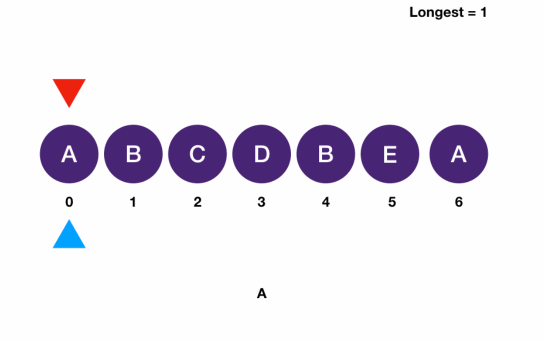

# Two Pointers: Sliding Window
## Longest Substring Without Repeating Characters
```
Find the length of the longest substring of a given string without repeating characters.

Input: abccabcabcc

Output: 3

Explanation: longest substrings are abc, cab, both of length 3


Input: aaaabaaa

Output: 2

Explanation: ab is the longest substring, length 2
```
```javascript
function longestSubstringWithoutRepeatingCharacters(s) {
  let left = 0;
  let right = 0;
  let max = 0;
  let map = {};

  while(right < s.length){
    const rightChar = s[right];
    if (map[rightChar]) {
      map[rightChar] = map[rightChar] + 1;  // add duplicate count
    } else {
      map[rightChar] = 1;
    }

    while (map[rightChar] > 1) {  // move left pointer, loop will only break when discovered duplicate has been removed from memory
      const leftChar = s[left];
      if (map[leftChar] === 1) {
        delete map[leftChar];  // remove duplicate or any current and subsequent characters until arrive at duplicate
      } else {
        map[leftChar] = map[leftChar] - 1;  // reduce duplicate or any current and subsequent characters until arrive at duplicate
      }
      left++;
    }
    max = Math.max(max, right-left+1);
    right++;
  }
  return max;
}
```
```
f                   longest: 1, add A: 1
A B C D B E A
s

  f                 longest: 2, add B: 1
A B C D B E A
s

    f               longest: 3, add C: 1
A B C D B E A
s

      f             longest: 4, add D: 1
A B C D B E A
s

        f           add B: 2, since A: 1, delete A, s + 1;
A B C D B E A
s

        f           since B: 2, reduce B duplicate by 1, thus B: 1, s + 1
A B C D B E A
  s

        f           since B not > 1 break loop, longest: 4 - 2 + 1 = 3
A B C D B E A
    s

          f         longest: 4, add E: 1
A B C D B E A
    s
  
            f       longest: 5, add A: 1
A B C D B E A
    s
    
              f     loop breaks
A B C D B E A
    s
```



### Explanation
- For a substring starting with start that already contains one duplicate character we want to stop checking more substrings with start index
- When this happens we want to increment start and look at next set of substrings
- This makes it a classic sliding window problem
  - A sliding window is defined by two pointers
    - We move the window (incrementing pointers) whiles maintaining a certain variant
    - For this particular problem, the variant is the characters inside the window being unique
      - We use a set to record what's in the window
        - And when we encounter a character that's already in the window
        - we want to move the left pointer until it goes past the last occurrence of that character
- Time Complexity: `O(n)`
