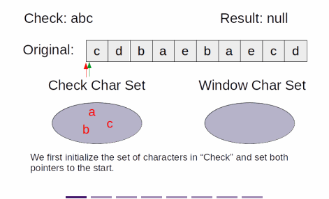
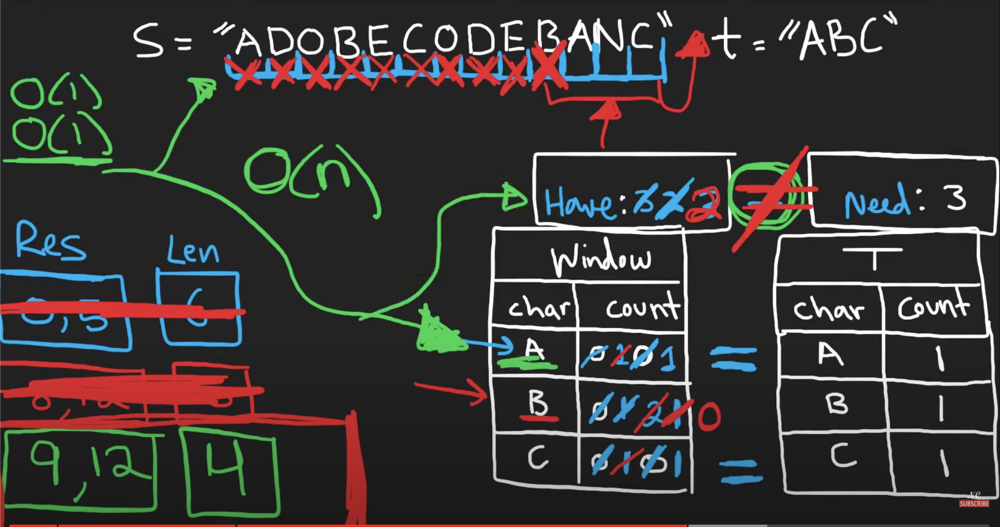

# Two Pointers: Sliding Window
## Minimum Window Substring
```
Given two strings, original and check,
return the minimum substring of original such that each character in check,
including duplicates, are included in this substring.
By "minimum", It mean the shortest substring.
If two substrings that satisfy the condition has the same length, 
the one that comes lexicographically first are smaller.

Parameters
  original: The original string.
  
  check: The string to check if a window contains it.

Result
  The smallest substring of original that satisfy the condition.


Example 1
  Input: original = "cdbaebaecd", check = "abc"

  Output: baec

  Explanation: baec is the shortest substring of original that contains all of a, b, and c.

Constraints
  1 <= len(check), len(original) <= 10^5
  original and check both contains only upper case and lower case characters in English.
  The characters are case sensitive.
```
- solution 1: using array
```javascript
function getMinimumWindow(original, check) {
  if (check.length > original.length) return "";
  const checkMemo = {};
  let result = "";
  let checkCountMemo = {};
  const windowArr = [];
  let resultLength = Infinity;

  for (let i=0; i<check.length; i++) {
    const char = check[i];
    checkMemo[char] = 1;
  }
  const uniqueCheckLength = Object.keys(checkMemo).length;

  for (let i=0; i<original.length; i++) {
    const char = original[i];
    windowArr.push(char);
    let checkCount = Object.keys(checkCountMemo).length;

    if (checkMemo[char] && checkCount < uniqueCheckLength) {
      checkCountMemo[char] >= 1 ? checkCountMemo[char] += 1 : checkCountMemo[char] = 1 ;
      checkCount = Object.keys(checkCountMemo).length;
    }

    while (checkCount === uniqueCheckLength) {
      if (windowArr.length < check.length) break;
      if (windowArr.length < resultLength) {
        resultLength = windowArr.length;
        result = windowArr.join("");
      } else if (windowArr.length === resultLength) {
        for (let j=0; j<windowArr.length; j++) {
          if (windowArr[j].charCodeAt() < result[j].charCodeAt()) {
            resultLength = windowArr.length;
            result = windowArr.join("");
            break;
          } else if (windowArr[j].charCodeAt() > result[j].charCodeAt()) {
            break;
          }
        }
      }
      const removeChar = windowArr.shift();
      checkCountMemo[removeChar] > 1 ? checkCountMemo[removeChar] -= 1 : delete checkCountMemo[removeChar];
      checkCount = Object.keys(checkCountMemo).length;
    }
  }
  return result;
}
```
- solution 2: using string
```javascript
function getMinimumWindow(original, check) {
  if (check.length > original.length) return "";
  const checkMemo = {};
  let result = "";
  let checkCountMemo = {};
  let windowStr = "";
  let left = 0;
  let resultLength = Infinity;

  for (let i=0; i<check.length; i++) {
    const char = check[i];
    checkMemo[char] = 1;
  }
  const uniqueCheckLength = Object.keys(checkMemo).length;

  for (let i=0; i<original.length; i++) {
    const char = original[i];
    windowStr = original.substring(left, i+1);
    let checkCount = Object.keys(checkCountMemo).length;

    if (checkMemo[char] && checkCount < uniqueCheckLength) {
      checkCountMemo[char] >= 1 ? checkCountMemo[char] += 1 : checkCountMemo[char] = 1 ;
      checkCount = Object.keys(checkCountMemo).length;
    }

    while (checkCount === uniqueCheckLength) {
      if (windowStr.length < check.length) break;
      if (windowStr.length < resultLength) {
        resultLength = windowStr.length;
        result = windowStr;
      } else if (windowStr.length === resultLength) {
        for (let j=0; j<windowStr.length; j++) {
          if (windowStr[j].charCodeAt() < result[j].charCodeAt()) {
            resultLength = windowStr.length;
            result = windowStr;
            break;
          } else if (windowStr[j].charCodeAt() > result[j].charCodeAt()) {
            break;
          }
        }
      }
      const removeChar = windowStr[0];
      checkCountMemo[removeChar] > 1 ? checkCountMemo[removeChar] -= 1 : delete checkCountMemo[removeChar];
      checkCount = Object.keys(checkCountMemo).length;
      left++;
      windowStr = original.substring(left, i+1);
    }
  }
  return result;
}
```
- solution 3: most optimum
```javascript
function getMinimumWindow(s, t) {
  const sLength = s.length;
  const tLength = t.length;
  if (tLength > sLength) return "";
  let have = 0;
  let need = 0;
  const sMemo = {};
  const tMemo = {};
  let result = "";
  let left = 0;

  for (let i=0; i<tLength; i++) {
    const char = t[i];
    if (!tMemo[char]) {
      tMemo[char] = 1;
      need++;
    } else {
      tMemo[char] += 1;
    }
  }

  for (let i=0; i<sLength; i++) {
    const char = s[i];
    if (tMemo[char]) {  // add or increment element into sMemo if is what we are looking for
      sMemo[char] ? sMemo[char] += 1 : sMemo[char] = 1;
      if (tMemo[char] === sMemo[char]) have++;
    }

    while (have === need) {
      const leftChar = s[left];
      const windowLength = i - left + 1;
      if (!result || windowLength < result.length) {
        result = s.substring(left, i+1);
      } else if (windowLength === result.length) {  // remove this if comparing between same length string is not required
        for (let j=0; j<windowLength; j++) {
          if (s[left+j].charCodeAt() < result[j].charCodeAt()) {
            result = s.substring(left, i+1);
            break;
          } else if (s[left+j].charCodeAt() > result[j].charCodeAt()) break;
        }
      }

      sMemo[leftChar] > 1 ? sMemo[leftChar] -= 1 : delete sMemo[leftChar];
      if (tMemo[leftChar] && (!sMemo[leftChar] || sMemo[leftChar] < tMemo[leftChar])) {
        have--;
      }
      left++;
    }
  }
  return result;
}
```





### Explanation
- The solution is similar to Find All Anagrams in a String,
  - except instead of matching exactly, we are to find a window that contains all characters in check
- the comparison for checking valid window is changed to compare that for every character in check
  - see if the window contains more of that character
- the moving conditions of the window changes as well
  - Instead of two pointers moving at once, maintaining the size of the window, each pointer moves independently
  - When the window does not contain check, we move the end pointer until it does (or it reaches the end)
    - then we move the start pointer until the window no longer contains check
  - just before moving the window is the local minimal substring
    - Then it's comparing local minimal substrings and finding the minimum one
- Time Complexity: `O(n)`
