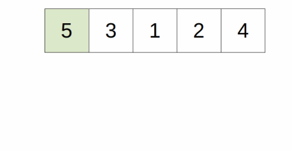
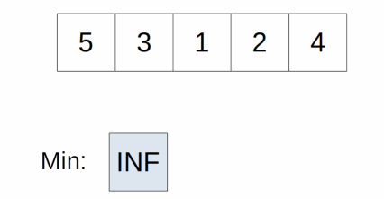

# Sorting
- `stable sorting algorithm` means that when two elements have the same value, their relative order is maintained
  - e.g. if we are sorting a hand of cards, and we have a Seven of Hearts before a Seven of Spades in the initial hand
    - after a stable sort, the Seven of Hearts is still before the Seven of Spades because their values are the same
    - However, in an unstable algorithm, the Seven of Spades might appear before the Seven of Hearts
    - The above is only true when we are comparing the cards by value, not suit
    - That is, two cards of the same value can be different
- `in-place sorting algorithm` means that the algorithm does not use additional data structure to hold temporary data
  - Additional memory cannot be avoided (as swapping two elements involve additional memory)
    - but they should be something like a temporary variable that uses very little additional memory
## Insertion Sort
- idea of an insertion sort is initially, only the first item is considered sorted
  - Then, for each item in the sequence, we "insert" that item into the sorted list by swapping that item with the item before it
  - until the item before it is smaller than the current item
- Imagine you are sorting a hand of cards
  - What people usually do is maintain a pile of sorted cards
  - and inserting from the unsorted pile into the sorted pile in the correct position
- It is a `stable algorithm` because later elements will not swap with earlier elements unless the later element is smaller
- it is an `in-place algorithm` because no additional data structure is used to store intermediate values



### JavaScript
```javascript
function sortList(unsortedList) {
  for (let i=0; i<unsortedList.length; i++) {
    let current = i;
    while (current > 0 && unsortedList[current] < unsortedList[current - 1]) {
      [unsortedList[current], unsortedList[current - 1]] = [unsortedList[current - 1], unsortedList[current]];
      current--;
    }
  }
}

const test = [5, 3, 1, 2, 4];
const res = sortList(test)
console.log(test)
```
```
input: [5, 3, 1, 2, 4]

current = 0, move to next loop

current = 1, is input[1] < input[0] = true
3 < 5, swap 3 with 5 = [3, 5, 1, 2, 4]
current = 0, move to next loop

current = 2, is input[2] < input[1] = true
1 < 5, swap 1 with 5 = [3, 1, 5, 2, 4]
current = 1, is input[1] < input[0] = true
1 < 3, swap 1 with 3 = [1, 3, 5, 2, 4]
current = 0, move to next loop

current = 3, is input[3] < input[2] = true
2 < 5, swap 2 with 5 = [1, 3, 2, 5, 4]
current = 2, is input[2] < input[1] = true
2 < 3, swap 2 with 3 = [1, 2, 3, 5, 4]
current = 1, is input[1] < input[0] = false
2 > 1, no swap = [1, 2, 3, 5, 4]
current = 0, move to next loop

current = 4, is input[4] < input[3] = true
4 < 5, swap 4 with 5 = [1, 2, 3, 4, 5]
current = 3, is input[3] < input[2] = false
4 > 3, no swap = [1, 2, 3, 4, 5]
current = 2, is input[2] < input[1] = false
3 > 2, no swap = [1, 2, 3, 4, 5]
current = 1, is input[1] < input[0] = false
3 > 1, no swap = [1, 2, 3, 4, 5]
current = 0, end loop

output: [1, 2, 3, 4, 5]
```
### time space complexity
- For each n item in the list, the time complexity to insert it into the sorted list is `O(i)`
  - where i is the index of that item
- Overall, the time complexity is `O(n * (n - 1) / 2)`
  - which is equivalent to `O(n^2)`
## Selection Sort
- during each cycle, we find the smallest item from the unsorted pile and add it to the sorted pile
- To find the smallest element in the unsorted pile
  - have a temporary variable keeping track of the index to the smallest element
  - compare each element in the unsorted pile to that element, updating the new index if necessary
- After all the elements have been compared
  - swap the smallest index with the first index of the unsorted pile
  - The element is now part of the sorted pile
- `not a stable algorithm` because an earlier element can jump after an element of the same value during a swap
- `algorithm is in-place` as it only needs additional memory to store the index to the minimum element



### JavaScript
```javascript
function sortList(unsortedList) {
  const n = unsortedList.length;
  for (let i=0; i<n; i++) {
    let minIndex = i;
    for (let j=i; j<n; j++) {
      if (unsortedList[j] < unsortedList[minIndex]) {
        minIndex = j;
      }
    }
    [unsortedList[i], unsortedList[minIndex]] = [unsortedList[minIndex], unsortedList[i]]
  }
  return unsortedList;
}

const test = [5, 3, 1, 2, 4];
const res = sortList(test)
console.log(test)
```
```
input: [5, 3, 1, 2, 4]

minIndex = 0, is input[0] < input[0] = false
5 === 5, no change in minIndex, move to next loop
minIndex = 0, is input[1] < input[0] = true
3 < 5, change minIndex to 1, move to next loop
minIndex = 1, is input[2] < input[1] = true
1 < 3, change minIndex to 2, move to next loop
minIndex = 2, is input[3] < input[2] = false
2 > 1, no change in minIndex, move to next loop
minIndex = 2, is input[4] < input[2] = false
4 > 1, no change in minIndex, end loop
swap input[0] with input[2] = swap 5 with 1 = [1, 3, 5, 2, 4]
move to next loop

minIndex = 1, is input[1] < input[1] = false
3 === 3, no change in minIndex, move to next loop
minIndex = 1, is input[2] < input[1] = false
5 > 3, no change in minIndex, move to next loop
minIndex = 1, is input[3] < input[1] = true
2 < 3, change minIndex to 3, move to next loop
minIndex = 3, is input[4] < input[3] = false
4 > 2, no change in minIndex, end loop
swap input[1] with input[3] = swap 3 with 2 = [1, 2, 5, 3, 4]
move to next loop

minIndex = 2, is input[2] < input[2] = false
5 === 5, no change in minIndex, move to next loop
minIndex = 2, is input[3] < input[2] = true
3 < 5, change minIndex to 3, move to next loop
minIndex = 3, is input[4] < input[3] = false
4 > 3, no change in minIndex, end loop
swap input[2] with input[3] = swap 5 with 3 = [1, 2, 3, 5, 4]
move to next loop

minIndex = 3, is input[3] < input[3] = false
5 === 5, no change in minIndex, move to next loop
minIndex = 3, is input[4] < input[3] = true
4 < 5, change minIndex to 4, end loop
swap input[3] with input[4] = swap 5 with 4 = [1, 2, 3, 4, 5]

minIndex = 4, is input[4] < input[4] = false
5 === 5, no change in minIndex, end loop
end loop

output: [1, 2, 3, 4, 5]
```
### time space complexity
- For each n item in the list, the time complexity to find the smallest item in the unsorted pile is `O(n - i)`
  - where i is the index of that item
- Overall, the time complexity is `O(n * (n + 1) / 2)`
  - which is equivalent to `O(n^2)`
## Bubble Sort
## Merge Sort
## Quick Sort
