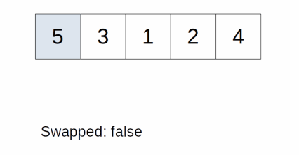
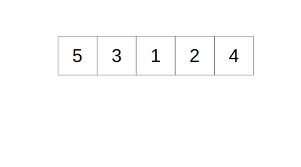
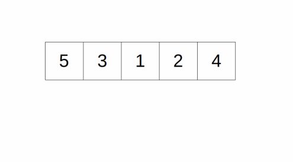

# Sorting
- `stable sorting algorithm` means that when two elements have the same value, their relative order is maintained
  - e.g. if we are sorting a hand of cards, and we have a Seven of Hearts before a Seven of Spades in the initial hand
    - after a stable sort, the Seven of Hearts is still before the Seven of Spades because their values are the same
    - However, in an unstable algorithm, the Seven of Spades might appear before the Seven of Hearts
    - The above is only true when we are comparing the cards by value, not suit
    - That is, two cards of the same value can be different
- `in-place sorting algorithm` means that the algorithm does not use additional data structure to hold temporary data
  - Additional memory cannot be avoided (as swapping two elements involve additional memory)
    - but they should be something like a temporary variable that uses very little additional memory
## Insertion Sort
- idea of an insertion sort is initially, only the first item is considered sorted
  - Then, for each item in the sequence, we "insert" that item into the sorted list by swapping that item with the item before it
  - until the item before it is smaller than the current item
- Imagine you are sorting a hand of cards
  - What people usually do is maintain a pile of sorted cards
  - and inserting from the unsorted pile into the sorted pile in the correct position
- It is a `stable algorithm` because later elements will not swap with earlier elements unless the later element is smaller
- it is an `in-place algorithm` because no additional data structure is used to store intermediate values


### JavaScript
```javascript
function sortList(unsortedList) {
  for (let i=0; i<unsortedList.length; i++) {
    let current = i;
    while (current > 0 && unsortedList[current] < unsortedList[current - 1]) {
      [unsortedList[current], unsortedList[current - 1]] = [unsortedList[current - 1], unsortedList[current]];
      current--;
    }
  }
}

const test = [5, 3, 1, 2, 4];
const result = sortList(test);
console.log(test);
```
```
input: [5, 3, 1, 2, 4]

current = 0, move to next loop

current = 1, is input[1] < input[0] = true
3 < 5, swap 3 with 5 = [3, 5, 1, 2, 4]
current = 0, move to next loop

current = 2, is input[2] < input[1] = true
1 < 5, swap 1 with 5 = [3, 1, 5, 2, 4]
current = 1, is input[1] < input[0] = true
1 < 3, swap 1 with 3 = [1, 3, 5, 2, 4]
current = 0, move to next loop

current = 3, is input[3] < input[2] = true
2 < 5, swap 2 with 5 = [1, 3, 2, 5, 4]
current = 2, is input[2] < input[1] = true
2 < 3, swap 2 with 3 = [1, 2, 3, 5, 4]
current = 1, is input[1] < input[0] = false
2 > 1, no swap = [1, 2, 3, 5, 4]
current = 0, move to next loop

current = 4, is input[4] < input[3] = true
4 < 5, swap 4 with 5 = [1, 2, 3, 4, 5]
current = 3, is input[3] < input[2] = false
4 > 3, no swap = [1, 2, 3, 4, 5]
current = 2, is input[2] < input[1] = false
3 > 2, no swap = [1, 2, 3, 4, 5]
current = 1, is input[1] < input[0] = false
3 > 1, no swap = [1, 2, 3, 4, 5]
current = 0, end loop

output: [1, 2, 3, 4, 5]
```
### time space complexity
- For each n item in the list, the time complexity to insert it into the sorted list is `O(i)`
  - where i is the index of that item
- Overall, the time complexity is `O(n * (n - 1) / 2)`
  - which is equivalent to `O(n^2)`
## Selection Sort
- during each cycle, we find the smallest item from the unsorted pile and add it to the sorted pile
- To find the smallest element in the unsorted pile
  - have a temporary variable keeping track of the index to the smallest element
  - compare each element in the unsorted pile to that element, updating the new index if necessary
- After all the elements have been compared
  - swap the smallest index with the first index of the unsorted pile
  - The element is now part of the sorted pile
- `not a stable algorithm` because an earlier element can jump after an element of the same value during a swap
- `algorithm is in-place` as it only needs additional memory to store the index to the minimum element


### JavaScript
```javascript
function sortList(unsortedList) {
  const n = unsortedList.length;
  for (let i=0; i<n; i++) {
    let minIndex = i;
    for (let j=i; j<n; j++) {
      if (unsortedList[j] < unsortedList[minIndex]) {
        minIndex = j;
      }
    }
    [unsortedList[i], unsortedList[minIndex]] = [unsortedList[minIndex], unsortedList[i]]
  }
  return unsortedList;
}

const test = [5, 3, 1, 2, 4];
const result = sortList(test);
console.log(test);
```
```
input: [5, 3, 1, 2, 4]

minIndex = 0, is input[0] < input[0] = false
5 === 5, no change in minIndex, move to next loop
minIndex = 0, is input[1] < input[0] = true
3 < 5, change minIndex to 1, move to next loop
minIndex = 1, is input[2] < input[1] = true
1 < 3, change minIndex to 2, move to next loop
minIndex = 2, is input[3] < input[2] = false
2 > 1, no change in minIndex, move to next loop
minIndex = 2, is input[4] < input[2] = false
4 > 1, no change in minIndex, end loop
swap input[0] with input[2] = swap 5 with 1 = [1, 3, 5, 2, 4]
move to next loop

minIndex = 1, is input[1] < input[1] = false
3 === 3, no change in minIndex, move to next loop
minIndex = 1, is input[2] < input[1] = false
5 > 3, no change in minIndex, move to next loop
minIndex = 1, is input[3] < input[1] = true
2 < 3, change minIndex to 3, move to next loop
minIndex = 3, is input[4] < input[3] = false
4 > 2, no change in minIndex, end loop
swap input[1] with input[3] = swap 3 with 2 = [1, 2, 5, 3, 4]
move to next loop

minIndex = 2, is input[2] < input[2] = false
5 === 5, no change in minIndex, move to next loop
minIndex = 2, is input[3] < input[2] = true
3 < 5, change minIndex to 3, move to next loop
minIndex = 3, is input[4] < input[3] = false
4 > 3, no change in minIndex, end loop
swap input[2] with input[3] = swap 5 with 3 = [1, 2, 3, 5, 4]
move to next loop

minIndex = 3, is input[3] < input[3] = false
5 === 5, no change in minIndex, move to next loop
minIndex = 3, is input[4] < input[3] = true
4 < 5, change minIndex to 4, end loop
swap input[3] with input[4] = swap 5 with 4 = [1, 2, 3, 4, 5]

minIndex = 4, is input[4] < input[4] = false
5 === 5, no change in minIndex, end loop
end loop

output: [1, 2, 3, 4, 5]
```
### time space complexity
- For each n item in the list, the time complexity to find the smallest item in the unsorted pile is `O(n - i)`
  - where i is the index of that item
- Overall, the time complexity is `O(n * (n + 1) / 2)`
  - which is equivalent to `O(n^2)`
## Bubble Sort
- idea of bubble sort is for each pass, we use a pointer to point at the first element of the list
  - For each cycle, we compare it to the next element in the list
  - and swap them if the current item is greater
  - then move the pointer by one until it reaches the end of the list
  - We repeat this process until the list becomes sorted
  - The list is sorted if, during a pass, no swapping occurs
- Note that during each pass, the largest element will always "float" to the top, like a bubble
  - Therefore, each pass, we only need to consider the interval excluding the last element of the previous interval
    - and the list is guaranteed to be sorted within n passes
- It is a stable algorithm because a swap cannot cause an element to move past another one with the same value
  - and it is in-place because no additional data structure is used



### JavaScript
```javascript
function sortList(unsortedList) {
  const n = unsortedList.length;
  for (let i=n-1; i>=0; i--) {
    let swapped = false;
    for (let j=0; j<i; j++) {
      if (unsortedList[j] > unsortedList[j + 1]) {
        [unsortedList[j], unsortedList[j+1]] = [unsortedList[j+1], unsortedList[j]];
        swapped = true;
      }
    }
    if (!swapped) return unsortedList;
  }
  return unsortedList;
}

const test = [5, 3, 1, 2, 4];
const result = sortList(test);
console.log(test);
```
```
input: [5, 3, 1, 2, 4]

i=4
set swapped to false
loop 4 times
1st loop is input[j] > input[j+1] = true
5 > 3, swap 5 with 3 = [3, 5, 1, 2, 4], set swapped to true
2nd loop is input[j] > input[j+1] = true
5 > 1, swap 5 with 1 = [3, 1, 5, 2, 4], set swapped to true
3rd loop is input[j] > input[j+1] = true
5 > 2, swap 5 with 2 = [3, 1, 2, 5, 4], set swapped to true
4th loop is input[j] > input[j+1] = true
5 > 4, swap 5 with 4 = [3, 1, 2, 4, 5], set swapped to true, end inner loop
since swapped is true, move to next outter loop

i=3
set swapped to false
loop 3 times
1st loop is input[j] > input[j+1] = true
3 > 1, swap 3 with 1 = [1, 3, 2, 4, 5], set swapped to true
2nd loop is input[j] > input[j+1] = true
3 > 2, swap 3 with 2 = [1, 2, 3, 4, 5], set swapped to true
3rd loop is input[j] > input[j+1] = false
3 < 4, swap 3 with 2 = [1, 2, 3, 4, 5], end inner loop
since swapped is true, move to next outter loop

i=2
set swapped to false
loop 2 times
1st loop is input[j] > input[j+1] = false
1 < 2, no swap, move to next inner loop
2nd loop is input[j] > input[j+1] = false
2 < 3, no swap, end inner loop
since swapped is false, end outter loop and return sorted array

output: [1, 2, 3, 4, 5]
```
### time space complexity
- time complexity of this algorithm is `O(n^2)`
  - because it is essentially two loops
## Merge Sort
- idea of a merge sort is divide and conquer
  - We divide the array into two almost equally
    - sort them (usually another merge sort)
    - and merge the two sorted list into one
  - To merge the two sorted list
    - have two pointers point towards the bottom of the two list
    - and each step, add the smaller element from those two into the list
    - and move the pointer of that item up by one until elements from both lists are fully added
- Assume the sorting of the divided list is stable, the overall algorithm is stable
  - because if an element appears before another element with the same value, there are two situations
    1. If they are in the same list
        - the first element is before the second one in that list
        - and the first one will be inserted first
    2. If they are in different lists
        - the first element will be inserted first if two elements are equal
- Note that the base case, where only one element exists in the list is stable
  - because there are no 2 elements of the same size, so merge sort is stable
- merge sort is not in-place because of the usage of additional arrays



### JavaScript
#### Recursion
```javascript
function merge(leftList, rightList, midIndex, n) {
  const result = [];
  let leftIndex = 0;
  let rightIndex = 0;
  while (leftIndex < midIndex || rightIndex < n - midIndex) {
    if (leftIndex === midIndex) {
      result.push(rightList[rightIndex]);
      rightIndex++;
    } else if (rightIndex === n - midIndex) {
      result.push(leftList[leftIndex]);
      leftIndex++;
    } else if (leftList[leftIndex] <= rightList[rightIndex]) {
      result.push(leftList[leftIndex]);
      leftIndex++;
    } else {
      result.push(rightList[rightIndex]);
      rightIndex++;
    }
  }
  return result;
}

function sortList(unsortedList) {
  const n = unsortedList.length;
  if (n <= 1) return unsortedList;

  const midIndex = Math.floor(n / 2);
  const leftList = sortList(unsortedList.slice(0, midIndex));
  const rightList = sortList(unsortedList.slice(midIndex));
  const sortedList = merge(leftList, rightList, midIndex, n);
  return sortedList;
}

const test = [5, 3, 1, 2, 4];
const result = sortList(test)
console.log(result)
```
```
input: [5, 3, 1, 2, 4]

  [5, 3, 1, 2, 4]
   /         \
[5, 3]    [1, 2, 4]
n > 1, midIndex is 2
work on the original left half first [5, 3]
add sortList(unsortedList.slice(0, 2)) to the stack
------------------
|sortList([5, 3])|
------------------

new unsortedList is [5, 3]
 [5, 3]
 /   \
[5]  [3]
since n > 1, new midIndex is 1
work on the new 1st left half [5]
new unsortedList is [5]
since n = 1, return [5]
------------------
|sortList([5, 3])|
------------------

leftList = [5]
work on the new 1st right half [3]
new unsortedList = [3]
since n = 1, return [3]
------------------
|sortList([5, 3])|
------------------

rightList = [3]
start merging leftList = [5] and rightList = [3]
midIndex remains at 1, n remains at 2
leftIndex = 0, rightIndex = 0, loop starts
since leftList[leftIndex] > rightList[rightIndex], 5 > 3
3 is added to the result array, rightIndex increment by 1 and is now 1, go to next loop
result array is [3]
since rightIndex === n - midIndex, 1 === 2 - 1
5 is added to the result array, leftIndex increment by 1 and is now 1
both leftIndex === midIndex & rightIndex === n - midIndex, end loop
result array is [3, 5]
--------
|[3, 5]|
--------
original left array = [3, 5]

new unsortedList is [1, 2, 4]
work on the original right half first [1, 2, 4]
add sortList(unsortedList.slice(2)) to the stack
---------------------
|sortList([1, 2, 4])|
---------------------

 [1, 2, 4]
  /     \
[1]    [2, 4]
new unsortedList is [1]
work on the new 2nd left half [1]
since n = 1, return [1]

leftList = [1]
work on the new 2nd right half [2, 4]
add sortList(unsortedList.slice(1)) to the stack
---------------------
|sortList([2, 4])   |
|sortList([1, 2, 4])|
---------------------

new unsortedList is [2, 4]
 [2, 4]
 /   \
[2]  [4]
since n > 1, new midIndex is 1
work on the new 3rd left half [2]
new unsortedList is [2]
since n = 1, return [2]

leftList = [2]
work on the new 3rd right half [4]
new unsortedList is [4]
since n = 1, return [4]

rightList = [4]
start merging leftList = [2] and rightList = [4]
midIndex is 1, n is 2
leftIndex = 0, rightIndex = 0, loop starts
since leftList[leftIndex] < rightList[rightIndex], 2 < 4
2 is added to the result array, leftIndex increment by 1 and is now 1, go to next loop
result array is [2]
since rightIndex === n - midIndex, 1 === 2 - 1
4 is added to the result array, leftIndex increment by 1 and is now 1
both leftIndex === midIndex & rightIndex === n - midIndex, end loop
result array is [2, 4]
return [2, 4]
---------------------
|[2, 4]             |
|sortList([1, 2, 4])|
---------------------

start merging leftList = [1] and rightList = [2, 4]
midIndex is 1, n is 3
leftIndex = 0, rightIndex = 0, loop starts
since leftList[leftIndex] < rightList[rightIndex], 2 < 4
1 is added to the result array, leftIndex increment by 1 and is now 1, go to next loop
since leftIndex === midIndex at 1
2 is added to the result array, rightIndex increment by 1 and is now 1, go to next loop
since leftIndex === midIndex at 1
4 is added to the result array, rightIndex increment by 1 and is now 1, go to next loop
both leftIndex === midIndex & rightIndex === n - midIndex, end loop
result array is [1, 2, 4]
return [1, 2, 4]
------------------
|[1, 2, 4]       |
------------------

  [5, 3, 1, 2, 4]
   /         \
[3, 5]    [1, 2, 4]
original right array is [1, 2, 4]
start merging leftList = [3, 5] and rightList = [1, 2, 4]
midIndex is 2, n is 5
leftIndex = 0, rightIndex = 0, loop starts
since leftList[leftIndex] > rightList[rightIndex], 3 > 1
1 is added to the result array, rightIndex increment by 1 and is now 1, go to next loop
since leftList[leftIndex] > rightList[rightIndex], 3 > 2
2 is added to the result array, rightIndex increment by 1 and is now 2, go to next loop
since leftList[leftIndex] < rightList[rightIndex], 3 < 4
3 is added to the result array, leftIndex increment by 1 and is now 2, go to next loop
since leftList[leftIndex] > rightList[rightIndex], 5 > 4
4 is added to the result array, rightIndex increment by 1 and is now 3, go to next loop
since rightIndex === n - midIndex, 3
5 is added to the result array, left Index increment by 1 and is now 3, go to next loop
both leftIndex === midIndex & rightIndex === n - midIndex, end loop
result array is [1, 2, 3, 4, 5]
return [1, 2, 3, 4, 5]

output: [1, 2, 3, 4, 5]
```
#### Iterative
- also known as bottom up merge sort
  - we treat each element of the array as n sub arrays
  - then iteratively merge these sub array back and forth between two buffers
```javascript
function merge(left, right, leftLimit, rightLimit, sorted, buffer) {
  let i = left;

  //Compare the two sub arrays and merge them in the sorted order
  while (left < leftLimit && right < rightLimit) {
    if (sorted[left] <= sorted[right]) {
      buffer[i++] = sorted[left++];
    } else {
      buffer[i++] = sorted[right++];
    }
  }

  //If there are elements in the left sub arrray then add it to the result
  while (left < leftLimit) {
    buffer[i++] = sorted[left++];
  }

  //If there are elements in the right sub array then add it to the result
  while (right < rightLimit) {
    buffer[i++] = sorted[right++];
  }
}

function sortList(unsortedList) {
  //Create two arrays for sorting
  let sorted = [...unsortedList];
  let n = sorted.length;
  let buffer = new Array(n);

  for (let size = 1; size < n; size *= 2) {
    for (let leftStart = 0; leftStart < n; leftStart += 2*size) {

      //Get the two sub arrays
      let left = leftStart;
      let right = Math.min(left + size, n);
      let leftLimit = right;
      let rightLimit = Math.min(right + size, n);

      //Merge the sub arrays
      merge(left, right, leftLimit, rightLimit, sorted, buffer);
    }

    //Swap the sorted sub array and merge them
    [sorted, buffer] = [buffer, sorted];
  }

  return sorted;
}

const test = [5, 3, 1, 2, 4];
const result = sortList(test)
console.log(result)
```
```
input: [5, 3, 1, 2, 4]

create a new input array copy sorted = [5, 3, 1, 2, 4] and a new array buffer = [, , , , ] for sorting
n = 5
start outter loop, 1st loop, size = 1, 1 < n
start inner loop, 1st loop, leftStart = 0, 0 < n
get the 2 sub arrays
left = 0, since left + size < n, 0 + 1 < 5, right = 1
leftLimit = 1, since right + size < n, 1 + 1 < 5, rightLimit = 2
merge sub arrays [5], [3]

i = left = 0
is left < leftLimit and right < rightLimit, 0 < 1 and 1 < 2, true
start compare 2 sub arrays and merge them loop
is sorted[left] > sorted[right], 5 > 3, true
set buffer[i] = sorted[right], buffer[0] = sorted[1] = 3, increment i and right by 1, i = 1, right = 2
buffer [3, , , , ]
since right === rightLimit, loop breaks

check if elements in left sub array exist then add to buffer
is left < leftLimit, 0 < 1, true
buffer[i] = sorted[left], buffer[1] = sorted[1], buffer[1] = 5, increment i and left by 1, i = 2, left = 1
buffer [3, 5, , , ]
since left === leftLimit, 1 === 1, loop breaks

check if elements in right sub array exists then add to buffer
is right < rightLimit, 2 === 2, false, loop does not start


2nd inner loop, leftStart = 0 + 2 * 1 = 2, 2 < n
get the 2 sub arrays
left = 2, since left + size < n, 2 + 1 < 5, right = 3
leftLimit = 3, since right + size < n, 3 + 1 < 5, rightLimit = 4
merge sub arrays [1], [2]

i = left = 2
is left < leftLimit and right < rightLimit, 2 < 3 and 3 < 4, true
start compare 2 sub arrays and merge them loop
is sorted[left] < sorted[right], 1 < 2, true
set buffer[i] = sorted[left], buffer[2] = sorted[2] = 1, increment i and left by 1, i = 3, left = 3
buffer [3, 5, 1, , ]
since left === leftLimit, loop breaks

check if elements in left sub array exists then add to buffer
is left < leftLimit, 3 === 3, false, loop does not start

check if elements in right sub array exist then add to buffer
is right < rightLimit, 3 < 4, true
buffer[i] = sorted[right], buffer[3] = sorted[3], buffer[3] = 2, increment i and right by 1, i = 4, right = 4
buffer [3, 5, 1, 2, ]
since right === rightLimit, 4 === 4, loop breaks


3rd inner loop, leftStart = 2 + 2 * 1 = 4, 4 < n
get the 2 sub arrays
left = 4, since left + size === n, 4 + 1 === 5, right = 5
leftLimit = 5, since right + size > n, 5 + 1 > 5, rightLimit = 5
merge sub arrays [4], []

i = left = 4
is left < leftLimit and right < rightLimit, 4 < 5 and 5 < 5, false, loop does not start

check if elements in left sub array exist then add to buffer
is left < leftLimit, 4 < 5, true
buffer[i] = sorted[left], buffer[4] = sorted[4], buffer[4] = 4, increment i and left by 1, i = 5, left = 5
buffer [3, 5, 1, 2, 4]
since left === leftLimit, 5 === 5, loop breaks

check if elements in right sub array exists then add to buffer
is right < rightLimit, 5 === 5, false, loop does not start


since leftStart = 4 + 2 * 1 = 6, 6 > n, inner loop breaks
swap buffer with sorted array
new sorted array = [3, 5, 1, 2, 4], new buffer array values [5, 3, 1, 2, 4] are not important


2nd outter loop, size = 1 * 2 = 2, 2 < n
start inner loop, 1st loop, leftStart = 0, 0 < n
get the 2 sub arrays
left = 0
right = 2, since left + size < n, 0 + 2 < 5
leftLimit = 2
rightLimit = 4, since right + size < n, 2 + 2 = 4 < 5
merge sub arrays [3, 5], [1, 2]

i = left = 0
is left < leftLimit and right < rightLimit, 0 < 2 and 2 < 4, true
start compare 2 sub arrays and merge them loop
is sorted[left] > sorted[right], 3 > 1, true
set buffer[i] = sorted[right], buffer[0] = sorted[2] = 1, increment i and right by 1, i = 1, right = 3
buffer [1, 3, 1, 2, 4]
since right < rightLimit, loop continues
is sorted[left] > sorted[right], 3 > 2, true
set buffer[i] = sorted[right], buffer[1] = sorted[3] = 2, increment i and right by 1, i = 2, right = 4
buffer [1, 2, 1, 2, 4]
since right === rightLimit, loop breaks

check if elements in left sub array exist then add to buffer
is left < leftLimit, 0 < 2, true
buffer[i] = sorted[left], buffer[2] = sorted[0], buffer[2] = 3, increment i and left by 1, i = 3, left = 1
buffer [1, 2, 3, 2, 4]
since left < leftLimit, 1 < 2, loop continues
is left < leftLimit, 1 < 2, true
buffer[i] = sorted[left], buffer[3] = sorted[1], buffer[3] = 5, increment i and left by 1, i = 4, left = 2
buffer [1, 2, 3, 5, 4]
since left === leftLimit, loop breaks

check if elements in right sub array exists then add to buffer
is right < rightLimit, 4 === 4, false, loop does not start


2nd inner loop, leftStart = 0 + 2 * 2, 4 < n
get the 2 sub arrays
left = 4
right = 5, since left + size < n, 4 + 2 = 6 > 5
leftLimit = 5
rightLimit = 5, since right + size < n, 5 + 2 = 7 > 5
merge sub arrays [4], []

i = left = 4
is left < leftLimit and right < rightLimit, 4 < 5 and 5 < 5, false, loop does not start

check if elements in left sub array exist then add to buffer
is left < leftLimit, 4 < 5, true
buffer[i] = sorted[left], buffer[4] = sorted[4], buffer[4] = 4, increment i and left by 1, i = 5, left = 5
buffer [1, 2, 3, 5, 4]
since left === leftLimit, 5 === 5, loop breaks

check if elements in right sub array exists then add to buffer
is right < rightLimit, 5 === 5, false, loop does not start


since leftStart = 4 + 2 * 2 = 8, 8 > n, inner loop breaks
swap buffer with sorted array
new sorted array = [1, 2, 3, 5, 4], new buffer array values [3, 5, 1, 2, 4] are not important


3rd outter loop, size = 2 * 2 = 4, 4 < n
start inner loop, 1st loop, leftStart = 0, 0 < n
get the 2 sub arrays
left = 0
right = 4, since left + size < n, 0 + 4 < 5
leftLimit = 4
rightLimit = 5, since right + size < n, 4 + 4 = 8 > 5
merge sub arrays [1, 2, 3, 5], [4]

i = left = 0
is left < leftLimit and right < rightLimit, 0 < 4 and 4 < 5, true
start compare 2 sub arrays and merge them loop
is sorted[left] < sorted[right], 1 < 4, true
set buffer[i] = sorted[left], buffer[0] = sorted[0] = 1, increment i and left by 1, i = 1, left = 1
buffer [1, 5, 1, 2, 4]
since left < leftLimit, loop continues
is sorted[left] < sorted[right], 2 < 4, true
set buffer[i] = sorted[left], buffer[1] = sorted[1] = 2, increment i and left by 1, i = 2, left = 2
buffer [1, 2, 1, 2, 4]
since left < leftLimit, loop continues
is sorted[left] < sorted[right], 3 < 4, true
set buffer[i] = sorted[left], buffer[2] = sorted[2] = 3, increment i and left by 1, i = 3, left = 3
buffer [1, 2, 3, 2, 4]
since left < leftLimit, loop continues
is sorted[left] > sorted[right], 5 < 4, true
set buffer[i] = sorted[right], buffer[3] = sorted[4] = 4, increment i and right by 1, i = 4, right = 5
buffer [1, 2, 3, 4, 4]
since right === rightLimit, 5 === 5, loop breaks

check if elements in left sub array exist then add to buffer
is left < leftLimit, 3 < 4, true
buffer[i] = sorted[left], buffer[4] = sorted[3], buffer[4] = 5, increment i and left by 1, i = 5, left = 4
buffer [1, 2, 3, 4, 5]
since left === leftLimit, 4 === 4, loop breaks

check if elements in right sub array exists then add to buffer
is right < rightLimit, 5 === 5, false, loop does not start


since leftStart = 4 + 2 * 2 = 8, 8 > n, inner loop breaks
swap buffer with sorted array
new sorted array = [1, 2, 3, 4, 5], new buffer array values [1, 2, 3, 5, 4] are not important

3rd outter loop, size = 4 * 2 = 8, 8 > n, outter loop breaks

output: [1, 2, 3, 4, 5]
```
### time space complexity
- overall time complexity is `O(nlog(n))`
  - because for each item in the list
    - it is merged a number of times equal to the number of divisions to make to divide the list to a size of one
      - which is `O(log(n))` times
## Quick Sort
- idea of quick sort is We select an arbitrary element in the list (known as the "pivot")
  - we swap the elements in the list into two sides
    - a side where all the elements are smaller than the pivot
    - a side where all the elements are larger or equal to the pivot
  - After grouping them this way, we swap the pivot with the first element of the side that is larger or equal to the pivot
  - This way, each element to the left of the pivot is smaller than the pivot
    - and each element on the right is larger or equal to pivot
   - Then we just need to sort the left interval and the right interval (using the same method), then the list would be sorted
- how would it grouped together?
  - for the interval that we are sorting, we have a pointer point before the start and at the end (including the pivot)
  - For each swap, we move the start pointer until we find an element >= to the pivot (after the initial index)
    - and move the end pointer until we find an element <= to the pivot (before the initial index)
  - Then we can swap those two elements and restart the process
  - If those two pointers meet, we stop and then we can swap the pivot and the meeting point
- algorithm is not stable, as each swap skips a lot of values
- It sort the array in-place, as it does not require additional data structures
  - Note that this does not mean this algorithm happens in constant space



### JavaScript
```javascript
function sortListInterval(unsortedList, start, end) {
  if (end - start <= 1) return undefined;
  const pivot = unsortedList[end - 1];
  let startPointer = start;
  let endPointer = end - 1;
  while (startPointer < endPointer) {
    while (unsortedList[startPointer] < pivot && startPointer < endPointer) {
      startPointer++;
    }
    while (unsortedList[endPointer] >= pivot && startPointer < endPointer) {
      endPointer--;
    }
    if (startPointer === endPointer) {
      break;
    }
    [unsortedList[startPointer], unsortedList[endPointer]] = [unsortedList[endPointer], unsortedList[startPointer]];
  }
  [unsortedList[startPointer], unsortedList[end - 1]] = [unsortedList[end - 1], unsortedList[startPointer]];
  sortListInterval(unsortedList, start, startPointer);
  sortListInterval(unsortedList, startPointer + 1, end);
}

function sortList(unsortedList) {
  sortListInterval(unsortedList, 0, unsortedList.length);
  return unsortedList;
}

const test = [5, 3, 1, 2, 4];
const result = sortList(test)
console.log(test)
```
### time space complexity
- The time complexity of quick sort is a bit complicated
- On average, where the list is divided somewhere near the center each time, the time complexity is `O(nlog(n))`
- However, in the worst case scenario, each interval to sort is one less than the current interval
  - which would make the time complexity `O(n^2)`
    - This depends heavily on which pivot point you chooses
      - if you choose an end point as your pivot and the list is already sorted, it will reach this time complexity
      - Otherwise, the chance of this happening is very low
- uses recursion as its core logic, and the minimum recursion layers is equal to `log(n)`
